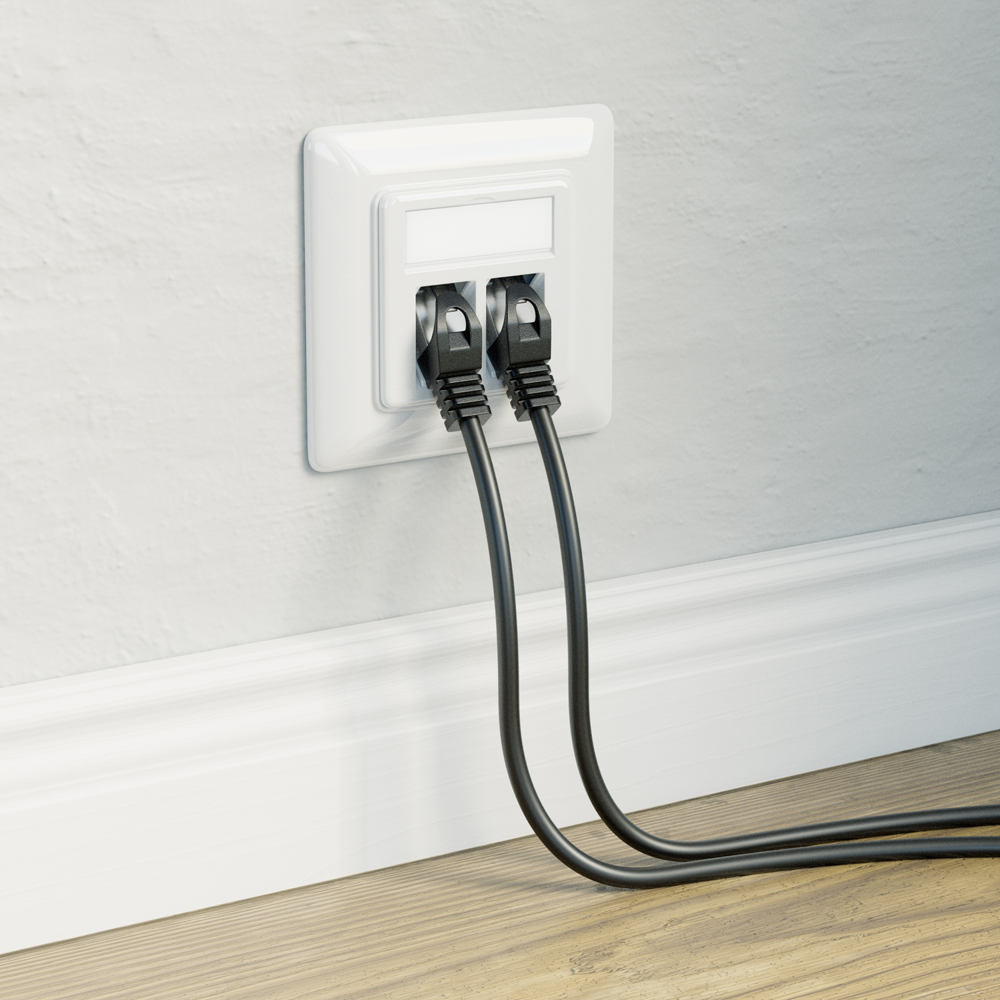

# Wohnungen mit Internetanschluss

Vermieter!

Wir wollen Wohnungen mit Internetanschluss.

Ein Internetanschluss in jeder Wohnung sollte genauso selbstverständlich sein wie

- ein Stromanschluss in jeder Wohnung
- ein Wasseranschluss in jeder Wohnung
- Fenster in jeder Wohnung

## Auskunftspflicht

Das einzige Problem dabei ist die Täter-Identifikation bei Straftaten im Internet.

Aber das ist ein gelöstes Problem!
Weil ein spezieller Router gibt jeder Wohnung einen eigenen IPv6-Präfix,
so dass man eine IP-Adresse eindeutig zuordnen kann zu einer Wohnung.
Damit kann der Vermieter seine Auskunftspflicht erfüllen gegenüber der Polizei.

(Wer immer noch zu blöd für VPN ist, der gehört bestraft...)

## Bandbreite

Ein 1080p Video-Stream "kostet" 5 Mbit/s,
also ein 1000 Mbit/s Downlink schafft 200 Video-Streams gleichzeitig.

Missbrauch von Bandbreite kann man leicht verhindern
durch eine Einstellung im Router: Fair Queuing.
Also wenn alle Mieter gleichzeitig das Internet nutzen,
dann kriegt jeder Mieter den gleichen Anteil.
Und wenn nur ein Mieter das Internet nutzt,
dann kann er den Anschluss voll auslasten.

## Peer-to-peer networking

Eine Frage bei einem gemeinsamen Internetanschluss ist:
Dürfen verschiedene Wohnungen direkt miteinander kommunizieren?

Anders gesagt:
Dürfen Mieter ein [Peer-to-peer Netzwerk](https://de.wikipedia.org/wiki/Peer-to-Peer) bauen?

Einstellen kann man das in der Router-Firewall.

Ein Argument dagegen wäre "die Sicherheit", aber ich glaube:

- wer nicht auf seine Sicherheit achtet, der verdient dass er gehackt wird
- wenn ein Mieter seine Nachbarn blockiert,
  dann hat der Rest vom Internet immer noch Zugang zum Netzwerk in seiner Wohnung,
  und dem Internetprovider (Telekom) ist es relativ egal
  was der Rest vom Internet mit diesem Zugang macht
- die Vorteile von direkter Kommunikation zwischen Wohnungen sind größer als die Nachteile

Wer zu blöd für [OpSec](https://en.wikipedia.org/wiki/Operational_security) ist,
der kann ja dann seinem Vermieter sagen:
"Bitte stellen Sie die Router-Firewall so ein,
dass andere Mieter keinen direkten Zugriff haben auf das Netzwerk in meiner Wohnung."
Aber das gilt dann in beide Richtungen,
also auch der paranoide Mieter hat dann
keinen direkten Zugriff auf das Netzwerk in anderen Wohnungen.

Wenn ein Mieter wirklich Mal so "schlau" ist,
und die Netzwerke seiner Nachbarn stört,
dann kann der Vermieter diesen Störer einfach blockieren per Firewall-Regel.
Weil der Internetanschluss beinhaltet nicht das Recht zum Stören seiner Nachbarn.

Wenn ein Mieter keinen direkten Zugriff hat auf das Netzwerk seiner Nachbarn,
aber trotzdem kommunizieren will mit seinen Nachbarn,
dann muss er seinen Netzwerkverkehr erst zum Internetprovider schicken (Telekom),
und der Internetprovider schickt den Netzwerkverkehr dann zurück
über das gleiche Netzwerkkabel zum Nachbar,
also dieser Weg kostet 2 "Hops" mehr (höhere Latenz),
und dieser Weg hat eine begrenzte Bandbreite (50 bis 500 Mbit/s),
und dieser Weg hinterlässt Spuren beim Internetprovider (Verbindungsdaten).

## Telefon

"Mimimi, aber ich will eine Telefonnummer..."

Jaja, hol dir ein [Voice-over-IP Telefon](https://de.wikipedia.org/wiki/IP-Telefonie) und gut iss.

## Fernseher

"Mimimi, aber [ich will meinen Fernseher](https://www.youtube.com/watch?v=lCX3_CQzXnU#title=Ich%20lasse%20mir%20das%20nicht%20mehr%20l%C3%A4nger%20gefallen%20Howard%20Beale%20Network%201976)..."

Ohje du trauriger Mensch, bist du echt hängen geblieben auf Propaganda?
Tja, die schlechte Nachricht ist, der Internetanschluss im Haus ist kein "Internet mit TV" Anschluss,
also wenn du ernsthaft Geld rauswerfen willst für Propaganda,
dann kauf dir bitte selber einen TV Anschluss.

Du könntest aber auch einfach Mal aktiv werden,
und dir deinen Content selbst aussuchen,
also selber Filme und Musik runterladen,
und dann bewusst konsumieren.
Man lernt nie aus...
Und andere Menschen schaffen das auch,
also auch das ist ein lösbares Problem.

## Fixkosten

Kosten entstehen einmalig für

- Netzwerkkabel verlegen in jede Wohnung
    - 2 Kabel je Wohnung für die Redundanz (Ausfallsicherheit)
    - Mit Glück liegen schon Leerrohre für alte TV-Kabel
    - WLAN ist keine Option wegen Elektrosmog und Latenz
    - [Netzwerkkabel Cat7 S/FTP Verlegekabel](https://www.ebay.de/itm/172626832392?var=472797335968) - 1 Euro/Meter = circa 40 Euro pro Wohnung
    - [Netzwerkdose Unterputz 2-Port Cat7](https://www.ebay.de/itm/177673300768?var=477284934070) - 10 Euro = 10 Euro pro Wohnung
- Router
  - [MikroTik RouterBOARD RB5009 Router, 8x RJ-45, 1x SFP+ Gigabit Router, 8x RJ-45, 1x SFP+, PoE PD](https://geizhals.de/mikrotik-routerboard-rb5009-router-rb5009ug-s-in-a2585362.html): 200 Euro
- Managed Switch
  - [TP-Link SG3400 JetStream Rackmount Gigabit Managed Switch, 24x RJ-45, 4x SFP](https://geizhals.de/tp-link-tl-sg34-jetstream-rackmount-gigabit-managed-switch-tl-sg3428-a2426203.html) - 200 Euro
  - [TP-Link SG3400 JetStream Rackmount Gigabit Managed Switch, 48x RJ-45, 4x SFP](https://geizhals.de/tp-link-sg3400-jetstream-rackmount-gigabit-managed-switch-tl-sg3452-a2520744.html) - 300 Euro

## Laufende Kosten

Langfristig ergeben sich
deutlich niedrigere laufende Kosten für die Mieter

Zum Vergleich:

Glasfaser-Internetanschlüsse bei der Telekom
kosten zwischen 46 und 71 Euro pro Monat

https://www.telekom.de/netz/glasfaser

- Telekom Glasfaser 150: 150 + 75 Mbit/s, 46 Euro/Monat
- Telekom Glasfaser 300: 300 + 150 Mbit/s, 51 Euro/Monat
- Telekom Glasfaser 600: 600 + 300 Mbit/s, 61 Euro/Monat
- Telekom Glasfaser 1000: 1000 + 500 Mbit/s, 71 Euro/Monat

Aber für ein Haus mit 12 Wohnungen reicht ein Internetanschluss mit 1000 + 500 Mbit/s,
und der kostet zwischen 8 und 12 Mal weniger
als 12 Internetanschlüsse für 12 Wohnungen.

<!--
12 * 71 / 71 = 12
12 * 46 / 71 = 8
-->

Für viele Mieter macht es schon einen Unterschied
ob sie jeden Monat 5 oder 50 Euro fürs Internet bezahlen.

## Die arme Telekom

Ich hörs schon...
"Mimimi, die arme Telekom,
die haben so viel Arbeit beim Verlegen von Glasfaserkabeln,
die sollen damit jetzt auch richtig viel Geld verdienen!"

Das ist ein Bullshit-Argument,
weil wenn die Telekom wirklich zu wenig verdient,
weil zu wenige Menschen die Glasfaser-Anschlüsse kaufen,
dann muss die Telekom einfach ihre Preise erhöhen.
Wird sie ja sowieso, allein schon wegen der Inflation.

Wenn dann die Preise steigen für Alle,
also auch für kleine Hauseigentümer,
dann können die sich ja auch einfach
einen Internetanschluss teilen mit ihren Nachbarn.

## Warum nicht

Für mich ist es extrem naheliegend
dass mehrere Nachbarn sich einen Internetanschluss teilen
zur Senkung der Kosten für Alle.
Aber ich bin auch ein technik-affiner Mensch,
also für mich ist das ein lösbares Problem,
zumindest auf der technischen Ebene.

Ich glaube,
auch hier scheitert der Fortschritt durch soziale Probleme,
also am Faktor Mensch,
weil zu viele Menschen haben keine Ahnung von Technik,
und zahlen lieber 10 Mal mehr für ihren Internetanschluss,
weil dann haben sie ihre "Sicherheit"...
(Das ist ganz ähnlich wie die Frage "Windows oder Linux?")
Aber von Aussen gesehen sind diese Menschen einfach nur dumm,
und seit wann ist es eine gute Idee,
wenn dumme Menschen das Leben schwer machen,
nicht nur für sich, sondern auch für ihre Nachbarn?

Ich hoffe,
es gibt genug schlaue Vermieter,
die sich einfach Mal ein paar Stunden hinsetzen,
und sich ein bisschen Reinlesen in die Materie,
und die sich nicht aufhalten lassen
von Idioten mit Angst vor dem Leben,
die alles verderben mit ihrem Sicherheitswahn.

Also, warum nicht?
Hab ich noch was vergessen?
Dann [schreibt mir ein GitHub Issue](https://github.com/milahu/wohnungen-mit-internetanschluss/issues),
oder [schreibt mir eine Postkarte](https://github.com/milahu/contact)...

## Stichworte

- Internetanschluss teilen mit Nachbarn
- gemeinsamer Internetanschluss
- Internet Sharing
- Internetanschluss Sharing
- Hausnetzwerk
- Intranet
- [Internetzugang ist ein Grundrecht](https://www.deutsche-handwerks-zeitung.de/bundesgerichtshof-internet-ist-ein-grundrecht-138243/)
- Netzwerk mit Nachbarn
- Router, Managed Switch, Glasfaser Modem
- VLAN Segmentation, Inter-VLAN-Routing
- IPv6-Präfix, Präfix-Delegation, Subnet, Subnetz

## Siehe auch

- [ChatGPT: IPv6 Präfix Aufteilung](doc/chat/ChatGPT-IPv6-Präfix-Aufteilung.md)
- [Mikrotik VLAN Konfiguration ab RouterOS Version 6.41](https://administrator.de/tutorial/mikrotik-vlan-konfiguration-ab-routeros-version-6-41-367186.html)
- [VLAN-Konfiguration mit MikroTik](https://elbtik.de/de/blog/mikrotik-vlan-setup)
- [VLAN-Installation und Routing mit pfSense & MikroTik: Anleitung](https://www.spickipedia.com/computer/vlan-installation-und-routing-mit-pfsense-mikrotik-anleitung.html)
- [MikroTik VLAN Segmentation — Inter-VLAN Routing, DHCP, and Firewall Rules](https://blog.gntech.me/posts/2026-05-12-mikrotik-vlan-segmentation/)
- [Glasfaseranschluss teilen / Zwei Haushalte](https://www.glasfaserforum.de/forum/thread/1592-glasfaseranschluss-teilen-zwei-haushalte/)
- [MikroTik RouterOS - Deutsche Glasfaser Konfiguration](https://github.com/flottokarotto/mikrotik-deutsche-glasfaser) - mit Gastnetz (isoliert)
